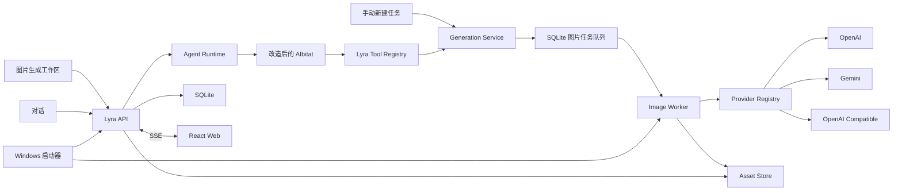
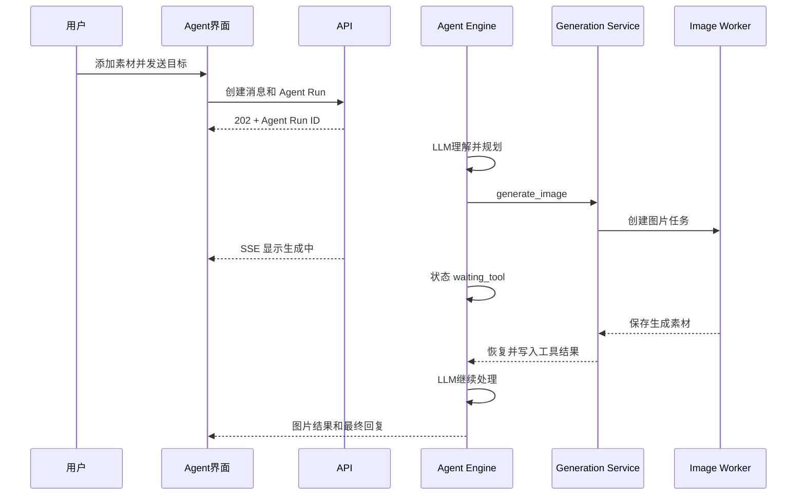

# Lyra 系统架构

## 1. 产品定位

Lyra 是一个 Agent 驱动、同时保留手动控制的图片生成应用。用户可以在同一个“图片生成”模块中切换两种模式：

- **Agent 模式**：用户通过连续对话提出目标、添加素材、验收结果和反馈修改；Agent 自动调用工具完成任务。
- **手动模式**：用户直接选择素材、图片供应商、模型、提示词和参数，获得更强控制能力。

两种模式共用同一套素材、供应商、生成服务、任务队列和 Worker，不实现两套图片业务。

同一套 Web、API 和 Worker 支持 Windows 本地启动器与单用户服务器私有部署。

### 1.1 重构边界

本方案是完全重构，不兼容当前前端、后端、Pi Agent 和数据库。AnythingLLM 作为 Agent Engine 的源码基础，不作为一个需要独立启动的完整外部系统。

新项目复用并改造 AnythingLLM 的 AIbitat 核心能力，同时替换其 Workspace、数据库、系统设置、前端和 RAG 附件体系。

## 2. 核心原则

1. **双模式、单后端**：手动模式和 Agent 模式最终都调用 `GenerationService`。
2. **用户决定素材**：只有发送框或手动面板中显式添加的有序素材进入本次请求。
3. **自然语言不分类**：三视图、换动作、换服装等都是提示词，不是固定业务枚举。
4. **Agent 是主交互方式之一**：Agent 可以多轮对话、调用工具、等待工具、请求补充信息并恢复执行。
5. **Agent Engine 与业务解耦**：AIbitat 负责工具循环，Lyra 负责对话、素材、任务、供应商和持久化。
6. **任务在后端运行**：关闭或刷新前端不取消 Agent 和图片任务。
7. **素材不可变**：任何输出都创建新素材，不覆盖源文件。
8. **供应商与模型分离**：连接、协议和模型分别配置；同一能力可启用多个连接，并通过供应商、模型两级选择执行目标。
9. **本地和服务器共用业务代码**：区别只在启动方式、数据目录、静态文件托管和认证。
10. **高成本操作先审核**：Agent 发起 AI 建模时先创建审核步骤，用户批准后才进入模型任务队列。

## 3. 总体架构



## 4. 前端图片生成工作区

### 4.1 图片生成导航

```text
图片生成
├─ 对话
├─ 手动新建任务
├─ 任务流
└─ 生成结果
```

Agent 和手动任务共用一个项目工作区、素材栏、任务流和任务中心，不再维护两个独立页面。

### 4.2 对话

主要区域：

- 对话列表
- 对话消息和 Agent 执行状态
- 生成中图片卡片和生成结果
- 有序素材发送区
- 任务流

用户负责提供素材、描述目标、验收结果和提出修改。供应商和参数默认由设置决定，用户仍可在需要时明确指定。

### 4.3 手动新建任务

主要区域：

- 素材栏
- 图片工作区
- 有序素材输入区
- 图片供应商、模型、数量、比例和扩展参数
- 提示词输入

手动任务不经过 Agent，直接创建图片任务，但任务结果仍进入当前对话和项目任务流。

### 4.4 共享输入基础组件

输入组件由 Lyra 自己维护，不与 AnythingLLM 的 Workspace、RAG 文件解析或路由绑定。

```text
ComposerBase
├─ AgentComposer
└─ ManualComposer
```

`ComposerBase` 负责：

- 多行文字和草稿
- Enter 发送、Shift+Enter 换行
- 图片粘贴和拖放
- 从素材库添加
- 图1、图2等有序附件
- 拖动排序、移除和预览
- 提示词库插入

`AgentComposer` 增加 Agent 运行状态、停止、补充信息和 LLM 选择。`ManualComposer` 增加图片供应商、模型和参数。

## 5. Agent Engine

### 5.1 源码复用

复用 AnythingLLM AIbitat 中经过验证的机制：

- 同步和流式工具调用循环
- 工具 JSON Schema 注册
- 工具结果重新交给 LLM
- 多轮工具调用和最大调用次数
- 中断、取消和请求用户输入
- 工具调用事件

不复用：

- AnythingLLM Workspace 和 WorkspaceChats
- SystemSettings 和全局供应商环境变量结构
- AnythingLLM 前端和 WebSocket 会话协议
- RAG、Collector 和默认通用 Skills
- Gmail、SQL、文件系统等无关工具

改造后的核心位于：

```text
packages/agent-engine
packages/agent-tools
```

保留原项目 MIT 许可证和必要的源码归属说明。

### 5.2 Agent 工具

当前提供：

```text
generate_image
generate_model
request_user_input
```

`generate_image` 不定义三视图、换发型等语义，它只接收自然语言提示词和通用生成参数。用户本轮显式添加的素材由 Agent Runtime 按原始顺序注入工具上下文，LLM 不能编造文件路径或静默遗漏素材。

`generate_model` 只接收图片资产 ID、可选纹理输入、输出格式和模型参数。首次调用会转为 `request_user_input` 审核请求，只有用户选择批准后，Agent 使用相同参数再次调用才会创建 `model.generate` 子任务。模型任务和图片任务使用同一任务队列，但由独立 Worker 执行。

LLM 请求只包含用户原文和按位置排列的素材标签、素材 ID，不包含图片二进制。真正执行图片任务时，图片供应商适配器再根据工具上下文读取素材二进制。Agent 默认提示词保存在版本化资源文件中；用户可在全局 Agent 设置中覆盖主系统提示词及提示词优化规则。Worker 在每轮新任务开始时从 `app_settings` 读取最新配置，运行中的任务不切换提示词。

未来可以增加：

```text
render_pose
search_assets
export_assets
```

### 5.3 Agent 持久化执行

AnythingLLM 当前 Agent 会话主要在内存中运行并与 WebSocket 生命周期关联。Lyra 必须改为可暂停、可恢复的执行状态：

```text
queued
thinking
calling_tool
waiting_tool
resuming
awaiting_user
completed
failed
cancelled
interrupted
```

当 Agent 调用长时间图片工具时：

1. 保存 LLM 工具调用步骤。
2. 创建 `image.generate` 子任务。
3. Agent Run 进入 `waiting_tool`，释放执行资源。
4. 图片 Worker 完成任务并保存素材。
5. 调度器将工具结果写回 Agent Run。
6. Agent 从 `resuming` 继续调用 LLM并生成最终回复或下一个工具调用。

浏览器断开只停止事件订阅，不停止后端执行。

每次 LLM 请求、LLM 响应、工具参数、工具结果、用户补充输入和最终回复都写入 `agent_steps`。进入 `waiting_tool` 或 `awaiting_user` 前必须先原子保存检查点；Agent Worker 重启后从最后一个完整检查点恢复，不重复创建已经存在的图片任务。

### 5.4 Agent 模式执行流



第一阶段不要求 Agent 自动评价图片质量。用户看到结果后验收并继续对话。以后需要自动评价时再加入独立视觉工具。

## 6. 统一图片生成服务

```ts
interface GenerationRequest {
  projectId: string;
  prompt: string;
  attachments: Array<{
    assetId: string;
    label: string;
    position: number;
  }>;
  providerProfileId: string;
  providerModelId: string;
  count: number;
  parameters: Record<string, unknown>;
  source: "agent" | "manual";
}
```

调用来源不同，但校验、任务、Worker、供应商、下载、素材保存和事件完全共用。

## 7. 后端组件

### 7.1 API

负责：

- 对话、消息和 Agent Run API
- 手动图片生成 API
- 素材、提示词、供应商和设置
- 输入校验和受控素材读取
- 从持久化事件表通过 SSE 推送状态
- 本地模式托管已构建 Web 静态文件

API 不在普通 HTTP 请求中等待图片生成完成。

HTTP body、分页查询、响应写入和服务依赖检查集中在
`apps/api/src/http-helpers.ts`，业务路由只负责路径匹配和调用应用服务。

### 7.2 Agent Worker

负责领取可运行的 Agent Run，执行 AIbitat 步骤，在工具等待时保存检查点并释放任务。

### 7.3 Image Worker

负责领取图片任务、读取有序素材、调用图片供应商、下载结果、写入 Asset Store 和完成工具结果。

第一版可以在一个 Worker 进程中使用独立执行池处理 Agent 与图片任务，代码层仍保持两个处理器；以后可以直接拆成两个进程。

### 7.4 Provider Registry

第一阶段实现：

- `OpenAiAdapter`
- `GeminiAdapter`
- `OpenAiCompatibleAdapter`

一个连接可配置多个 `llm`、`image` 和预留 `model` 模型。本地服务通过本地 Base URL 配置。

M2 只实现连接配置和模型发现；远端返回的模型 ID 不自动分类，由用户保存模型时明确选择服务类型。API Key 只保存在运行目录的 `config/.env`，SQLite 只保存环境变量名。

M6 的运行时路由按任务快照中的连接 ID 和模型 ID 动态解析：OpenAI LLM 使用 Responses API，OpenAI Compatible LLM 使用 Chat Completions，Gemini LLM 使用 Interactions API；图片分别使用 OpenAI Images API 和 Gemini Interactions API。图片 Worker 读取有序素材二进制，LLM 仍只收到用户文本和素材元数据。统一 HTTP 客户端负责超时、取消、响应大小限制、URL 下载和稳定错误码。

Gemini 工具调用把 `interaction_id` 保存到 Agent 检查点，恢复时通过 `previous_interaction_id` 回传工具结果。这样 Worker 重启后仍能继续当前工具轮次。具体参数和测试方式见 `docs/provider-adapters.md`。

API 和 Worker 通过 `packages/storage/src/runtime-repositories.ts` 使用同一套
Repository 组合，避免两个进程的持久化 wiring 漂移。

## 8. 任务和事件

图片任务状态：

```text
queued
running
succeeded
failed
cancelled
interrupted
```

Agent Run 与图片 Job 分开持久化，使用通用事件表向前端推送：

```text
agent.run.created
agent.thinking
agent.message.delta
agent.tool.called
agent.waiting_tool
agent.awaiting_user
agent.completed
job.created
job.updated
asset.created
```

SSE 断线重连使用事件 ID 补取；REST 查询仍是最终事实。

M4 使用 SQLite `BEGIN IMMEDIATE` 完成单任务原子领取。Worker 定时更新实例心跳和任务锁时间；正常停止会将未完成任务标记为 `interrupted`，新 Worker 启动时会恢复过期锁。取消运行中任务时只写入取消请求，由 Worker 中止供应商调用后完成状态转换。重试创建新任务并通过 `retry_of_job_id` 保留来源任务。

`runtime_events` 是 SSE 的持久化来源。SSE 支持 `afterEventId` 和 `Last-Event-ID`，浏览器断开只结束事件订阅，不影响 Agent Run 或图片 Job。

## 9. 数据和安全

本地发布目录：

```text
Lyra/
├─ LyraLauncher.exe
├─ app/
│  ├─ api/
│  ├─ worker/
│  └─ web/
├─ runtime/node/
└─ data/
   ├─ config/.env
   ├─ database/lyra.db
   ├─ blobs/
   ├─ thumbnails/
   ├─ logs/
   ├─ temp/
   └─ run/
```

- API Key 由后端写入 `data/config/.env`，前端不读取原值。
- API 不公开整个 `data` 目录。
- 素材原图按 SHA-256 使用内容寻址键写入不可变 Blob；相同内容复用 Blob，但保留独立素材记录。
- 素材上传按真实文件内容校验格式、MIME、尺寸和大小，上传文件名不能包含路径。
- 素材列表只读取独立 WebP 缩略图，原图和缩略图都通过受控素材 ID 接口读取并返回 ETag。
- 素材接口不返回 Blob 键、数据根目录或绝对路径。
- 桌面模式只监听 `127.0.0.1`。
- 服务器模式需要访问令牌或受认证的反向代理。
- Agent 工具不能直接读取任意文件路径或密钥。

## 10. 启动和部署

Windows 启动器使用 Python/Tkinter，负责启动 API 和 Worker、显示日志、健康检查、停止服务和打开浏览器。正式包不安装依赖或执行构建。

服务器不运行启动器，直接部署 Web 静态文件、API、Worker 和持久卷。第一阶段按单用户私有服务器设计。

## 11. 源码目录

```text
Lyra/
├─ apps/
│  ├─ web/
│  ├─ api/
│  ├─ worker/
│  └─ launcher/
├─ packages/
│  ├─ contracts/
│  ├─ core/
│  ├─ agent-engine/
│  ├─ agent-tools/
│  ├─ providers/
│  └─ storage/
├─ resources/prompts/
├─ tests/
│  ├─ unit/
│  ├─ integration/
│  ├─ e2e/
│  └─ fixtures/
├─ scripts/
├─ deploy/
└─ docs/
```

## 12. UI 导航

```text
图片生成
AI 建模
素材库
提示词库
设置
```

图片生成内部统一承载 Agent 和手动任务。任务不占用主导航，在右上角状态按钮和抽屉中展示。AI 建模使用独立页面，以项目图片为输入，提交后台任务并查看项目级 GLB 结果。

供应商连接按能力硬隔离：LLM、AI 生图、AI 建模分别保存连接和密钥，模型不能跨能力挂载。图片 Worker 与 Model Worker 分开领取任务，远程建模任务 ID 持久化后可在服务重启后继续查询。当前 Agent 状态通过 SSE 实时更新，助手正文在 LLM 请求完成后一次写入，不是 token 级流式输出。

## 13. 当前非目标

- Agent 自动评价图片质量
- 多模态 LLM 图片分析
- 遮罩和局部编辑器
- 固定图片生成工作流
- 多用户权限系统
- 分布式任务队列
- Agent 自动建模与多图片建模
