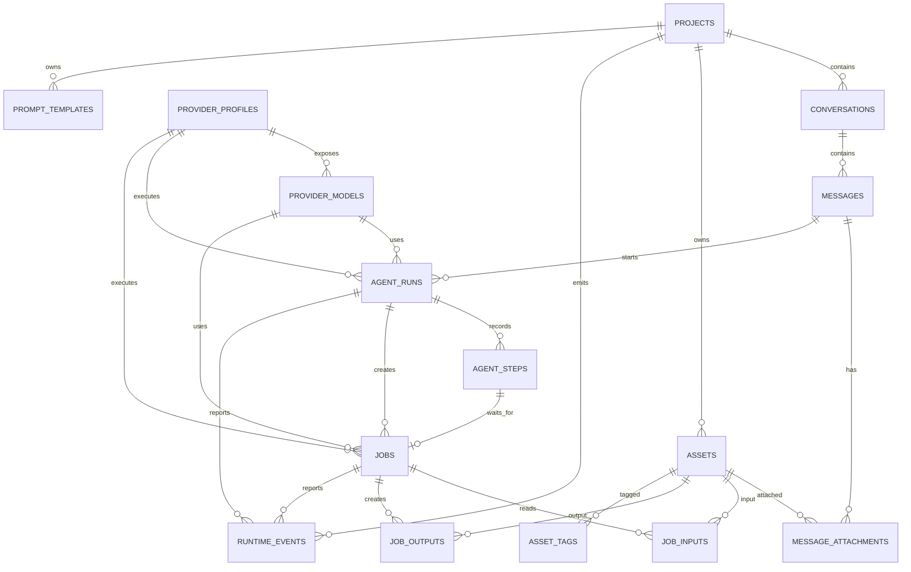

# Lyra 数据模型

## 1. 设计目标

- 支持 Agent 对话和直接配置两种任务创建入口。
- 支持 AIbitat 工具循环的暂停、恢复、补充输入和失败重试。
- 支持用户显式添加有序素材。
- 支持多个供应商连接和多个模型。
- 上传图片和生成图片使用统一素材模型，并按项目及来源隔离文件。
- 不为三视图、发型、服装等自然语言建立固定字段。
- SQLite 同时用于本地模式和单用户服务器模式。

## 2. 关系概览



## 3. 通用约定

- 业务主键使用 UUID 文本。
- 时间保存为 UTC ISO 8601。
- SQLite 开启外键、WAL 和合理的 busy timeout。
- 用户原始文字与 Agent 最终提示词分别保存。
- 文件绝对路径和 API Key 不进入公开响应或运行事件。

## 4. 表定义

### 4.1 `schema_migrations`

| 字段 | 类型 | 说明 |
|---|---|---|
| version | INTEGER PK | 迁移版本 |
| name | TEXT | 迁移名称 |
| applied_at | TEXT | 应用时间 |

### 4.2 `projects`

项目是对话、任务、素材和项目提示词的组织及数据隔离边界。首次启动自动创建默认项目；项目可创建、重命名、修改说明和软归档。

| 字段 | 类型 | 约束/说明 |
|---|---|---|
| id | TEXT PK | UUID |
| name | TEXT | 非空 |
| description | TEXT | 默认空字符串 |
| last_image_mode | TEXT | 旧版界面偏好字段，保留兼容 |
| created_at | TEXT | 非空 |
| updated_at | TEXT | 非空 |
| deleted_at | TEXT | 可空，软删除 |

### 4.3 `conversations`

Agent 对话和直接配置创建的任务都绑定当前对话。对话是工作区中的任务分组，也保存 Agent 消息。

| 字段 | 类型 | 约束/说明 |
|---|---|---|
| id | TEXT PK | UUID |
| project_id | TEXT FK | `projects.id` |
| title | TEXT | 可编辑 |
| created_at | TEXT | 非空 |
| updated_at | TEXT | 非空 |
| deleted_at | TEXT | 可空 |

索引：`project_id, updated_at DESC`。

### 4.4 `messages`

| 字段 | 类型 | 约束/说明 |
|---|---|---|
| id | TEXT PK | UUID |
| conversation_id | TEXT FK | `conversations.id` |
| role | TEXT | `user`、`assistant`、`system`、`tool` |
| text | TEXT | 原始消息文本 |
| reply_to_id | TEXT FK | 可空 |
| created_at | TEXT | 非空 |

用户输入原样保存。流式助手消息完成前可以由 Agent Run 更新，完成后不再修改。

### 4.5 `message_attachments`

发送框素材的唯一事实来源。

| 字段 | 类型 | 约束/说明 |
|---|---|---|
| id | TEXT PK | UUID |
| message_id | TEXT FK | `messages.id` |
| asset_id | TEXT FK | `assets.id` |
| position | INTEGER | 从 1 开始，消息内唯一 |
| label | TEXT | `图1`、`图2` 等 |
| created_at | TEXT | 非空 |

唯一约束：`message_id, position`。消息提交后不改变顺序。

### 4.6 `assets`

| 字段 | 类型 | 约束/说明 |
|---|---|---|
| id | TEXT PK | UUID |
| project_id | TEXT FK | `projects.id` |
| kind | TEXT | `image`、`model`、`file` |
| source | TEXT | `upload`、`generated` |
| name | TEXT | 用户可编辑名称 |
| original_name | TEXT | 上传文件名，可空 |
| mime_type | TEXT | 非空 |
| blob_key | TEXT | 数据目录内受控相对键 |
| checksum_sha256 | TEXT | 文件哈希 |
| byte_size | INTEGER | 文件大小 |
| width | INTEGER | 可空 |
| height | INTEGER | 可空 |
| created_at | TEXT | 非空 |
| updated_at | TEXT | 非空 |
| deleted_at | TEXT | 可空 |

`blob_key` 不是唯一字段。相同文件内容复用同一项目、同一来源下的内容寻址文件，但每次上传或生成仍创建独立素材记录。素材不可原地覆盖，软删除素材不删除文件。前端只能通过素材 ID 接口读取原图或缩略图，公开结果不包含 `blob_key`。

文件键按项目和来源组织：

```text
<project-id>/uploads/images/sha256/<prefix>/<checksum>.<ext>
<project-id>/generated/images/sha256/<prefix>/<checksum>.<ext>
```

### 4.7 `asset_tags`

| 字段 | 类型 | 约束/说明 |
|---|---|---|
| asset_id | TEXT FK | `assets.id` |
| tag | TEXT | 自由文本 |
| created_at | TEXT | 非空 |

联合主键：`asset_id, tag`。

### 4.8 `prompt_templates`

提示词模板属于应用全局数据，不随项目切换。测试阶段预置的模板与用户创建的模板使用同一套编辑、收藏、导入和导出规则。

| 字段 | 类型 | 约束/说明 |
|---|---|---|
| id | TEXT PK | UUID |
| name | TEXT | 非空 |
| category | TEXT | 用于筛选和分组的自由文本 |
| note | TEXT | 可空；适用模型或其他备注 |
| content | TEXT | 模板正文 |
| variables_json | TEXT | JSON 数组，可空 |
| favorite | INTEGER | 0/1 |
| created_at | TEXT | 非空 |
| updated_at | TEXT | 非空 |
| deleted_at | TEXT | 可空 |

模板只插入文字，不对应固定工具或流程。分类用于管理，模型适用性等说明保存在备注中。

### 4.9 `provider_profiles`

| 字段 | 类型 | 约束/说明 |
|---|---|---|
| id | TEXT PK | UUID |
| service_type | TEXT | `llm`、`image`、`model`，连接能力边界 |
| name | TEXT | 用户定义连接名称 |
| protocol | TEXT | `openai`、`gemini`、`openai-compatible` |
| base_url | TEXT | 可配置本地 URL |
| api_key_env | TEXT | `.env` 键名，不保存密钥值 |
| enabled | INTEGER | 0/1 |
| created_at | TEXT | 非空 |
| updated_at | TEXT | 非空 |
| deleted_at | TEXT | 可空 |

### 4.10 `provider_models`

| 字段 | 类型 | 约束/说明 |
|---|---|---|
| id | TEXT PK | UUID |
| provider_profile_id | TEXT FK | `provider_profiles.id` |
| service_type | TEXT | `llm`、`image`、`model` |
| remote_model_id | TEXT | 远端模型 ID |
| display_name | TEXT | 本地显示名称 |
| enabled | INTEGER | 0/1 |
| is_default | INTEGER | 同一服务类型最多一个默认值 |
| settings_json | TEXT | 非密钥参数 |
| created_at | TEXT | 非空 |
| updated_at | TEXT | 非空 |

唯一约束：`provider_profile_id, service_type, remote_model_id`。
模型的 `service_type` 必须与所属连接的 `service_type` 相同。同一连接不能同时供 LLM、AI 生图和 AI 建模复用。

### 4.11 `agent_runs`

表示一次可暂停和恢复的 Agent 执行，不与浏览器连接生命周期绑定。

| 字段 | 类型 | 约束/说明 |
|---|---|---|
| id | TEXT PK | UUID |
| project_id | TEXT FK | `projects.id` |
| conversation_id | TEXT FK | `conversations.id` |
| request_message_id | TEXT FK | 触发执行的用户消息 |
| status | TEXT | `queued`、`thinking`、`calling_tool`、`waiting_tool`、`resuming`、`awaiting_user`、`completed`、`failed`、`cancelled`、`interrupted` |
| llm_provider_profile_id | TEXT FK | LLM 连接 |
| llm_provider_model_id | TEXT FK | LLM 模型 |
| default_image_profile_id | TEXT FK | 默认图片连接，可空 |
| default_image_model_id | TEXT FK | 默认图片模型，可空 |
| system_prompt_version | TEXT | Agent 系统提示词版本 |
| max_tool_calls | INTEGER | 技术上限 |
| tool_call_count | INTEGER | 已调用数量 |
| current_step | INTEGER | 当前步骤序号 |
| cancel_requested | INTEGER | 0/1 |
| locked_by | TEXT | 可空，Agent Worker ID |
| locked_at | TEXT | 可空 |
| error_code | TEXT | 可空 |
| error_message | TEXT | 可空 |
| created_at | TEXT | 非空 |
| updated_at | TEXT | 非空 |
| finished_at | TEXT | 可空 |

索引：`status, created_at`、`conversation_id, created_at`。

### 4.12 `agent_steps`

保存 AIbitat 每次 LLM 和工具交互所需的检查点。

| 字段 | 类型 | 约束/说明 |
|---|---|---|
| id | TEXT PK | UUID |
| agent_run_id | TEXT FK | `agent_runs.id` |
| sequence | INTEGER | 从 1 递增 |
| type | TEXT | `llm_request`、`llm_response`、`tool_call`、`tool_result`、`user_input_request`、`user_input_result`、`final_message` |
| status | TEXT | `pending`、`running`、`waiting`、`completed`、`failed` |
| tool_name | TEXT | 可空 |
| payload_json | TEXT | 已清除密钥的检查点内容 |
| child_job_id | TEXT FK | 可空，长时间工具对应的图片任务 |
| created_at | TEXT | 非空 |
| updated_at | TEXT | 非空 |

唯一约束：`agent_run_id, sequence`。

工具执行前先保存 `tool_call`，工具完成后保存 `tool_result`，再恢复 Agent。这样进程重启后可以从最后一个完整步骤继续，而不是重复提交图片任务。

`payload_json` 保存已清除密钥的 LLM 请求/响应快照、工具参数/结果、用户补充输入和恢复检查点。公开事件不返回内部检查点。进入等待状态和保存对应检查点必须在同一事务边界完成。

### 4.13 `jobs`

表示 Agent 或直接配置创建的长时间业务任务。

| 字段 | 类型 | 约束/说明 |
|---|---|---|
| id | TEXT PK | UUID |
| project_id | TEXT FK | `projects.id` |
| conversation_id | TEXT FK | 当前工作区对话 |
| agent_run_id | TEXT FK | 可空；直接任务为空 |
| agent_step_id | TEXT FK | 可空 |
| request_message_id | TEXT FK | 可空 |
| retry_of_job_id | TEXT FK | 可空；重试来源任务 |
| source | TEXT | `agent`、`manual`；`manual` 表示直接配置入口 |
| kind | TEXT | `image.generate`、`model.generate` |
| status | TEXT | `queued`、`running`、`succeeded`、`failed`、`cancelled`、`interrupted` |
| title | TEXT | 用户文字截断 |
| stage | TEXT | 技术阶段 |
| provider_profile_id | TEXT FK | 执行连接 |
| provider_model_id | TEXT FK | 执行模型 |
| prompt | TEXT | 实际提示词 |
| request_json | TEXT | 已清除密钥的请求快照 |
| result_json | TEXT | 非文件结果摘要 |
| error_code | TEXT | 可空 |
| error_message | TEXT | 可空 |
| cancel_requested | INTEGER | 0/1 |
| attempt | INTEGER | 从 1 开始 |
| locked_by | TEXT | 可空，Image Worker ID |
| locked_at | TEXT | 可空 |
| created_at | TEXT | 非空 |
| started_at | TEXT | 可空 |
| finished_at | TEXT | 可空 |
| updated_at | TEXT | 非空 |

重试创建新任务并保留旧任务，新任务的 `attempt` 递增并通过 `retry_of_job_id` 指向直接来源任务。

### 4.14 `job_inputs`

| 字段 | 类型 | 约束/说明 |
|---|---|---|
| job_id | TEXT FK | `jobs.id` |
| asset_id | TEXT FK | `assets.id` |
| position | INTEGER | 从 1 开始 |
| label | TEXT | 图1、图2等 |

联合主键：`job_id, position`。Agent 和适配器不能静默重排或遗漏用户附件。

### 4.15 `job_outputs`

| 字段 | 类型 | 约束/说明 |
|---|---|---|
| job_id | TEXT FK | `jobs.id` |
| asset_id | TEXT FK | `assets.id` |
| position | INTEGER | 输出顺序 |

联合主键：`job_id, position`。

通过 `job_outputs -> jobs -> job_inputs` 追溯来源，不建立固定图片语义关系。

### 4.16 `runtime_events`

Agent Run 和图片 Job 共用的可恢复事件流。

| 字段 | 类型 | 约束/说明 |
|---|---|---|
| id | INTEGER PK AUTOINCREMENT | SSE 事件 ID |
| project_id | TEXT FK | `projects.id` |
| conversation_id | TEXT FK | 可空 |
| agent_run_id | TEXT FK | 可空 |
| job_id | TEXT FK | 可空 |
| type | TEXT | 事件类型 |
| payload_json | TEXT | 已清除密钥的 JSON |
| created_at | TEXT | 非空 |

事件示例：

```text
agent.run.created
agent.thinking
agent.message.delta
agent.tool.called
agent.waiting_tool
agent.awaiting_user
agent.completed
job.created
job.updated
asset.created
```

当前 SSE 实时发送 Agent 和任务状态；助手文本在一次 LLM 请求完成后写入，不做 token 级流式写入。

### 4.17 `worker_instances`

| 字段 | 类型 | 约束/说明 |
|---|---|---|
| id | TEXT PK | Worker 实例 UUID |
| kind | TEXT | `combined`、`agent`、`image` |
| version | TEXT | Worker 版本 |
| pid | INTEGER | 本地进程 ID，可空 |
| started_at | TEXT | 非空 |
| heartbeat_at | TEXT | 非空 |
| stopped_at | TEXT | 可空 |

第一版可以使用 `combined` Worker，但 Agent 和图片使用独立领取逻辑。

### 4.18 `app_settings`

| 字段 | 类型 | 约束/说明 |
|---|---|---|
| key | TEXT PK | 设置键 |
| value_json | TEXT | 非密钥 JSON |
| updated_at | TEXT | 非空 |

保存默认项目、默认模型、Agent 提示词覆盖、并发数和服务器设置。Agent 提示词使用 `agent.prompt-settings.v1` 键保存；API Key 不进入此表。

## 5. 关键不变量

1. Agent 和直接配置入口使用同一 `jobs`、`job_inputs`、`job_outputs` 和素材存储。
2. 消息和直接任务的附件顺序提交后不可修改。
3. Agent 工具调用必须先保存检查点，再创建不可重复的子任务。
4. 浏览器断开不能改变 Agent Run 或图片 Job 状态。
5. Agent 恢复时不能重复执行已完成工具步骤。
6. 用户原始消息、Agent 最终提示词和真实任务参数分别保存。
7. 输出素材文件不可原地覆盖。
8. 删除源素材不级联删除历史任务和输出；第一阶段只做软删除。
9. Worker 使用事务领取任务，避免重复执行。
10. 前端不能读取 API Key 原值和素材绝对路径。
11. LLM、AI 生图和 AI 建模使用不同的供应商连接记录与 API Key 环境变量。
12. 每种 `service_type` 可以启用多个供应商连接，但只能配置一个有效默认模型；默认供应商由该模型所属连接确定。
13. 项目之间不能读取或引用彼此的对话、任务和素材。
14. 上传素材和生成图片必须写入所属项目下各自的来源目录。

## 6. 迁移策略

- 使用按序 SQL 迁移，不在启动时执行破坏性自动同步。
- API 和 Worker 检查迁移版本，版本不匹配时拒绝执行。
- 旧版素材文件在启动时复制到所属项目目录并更新素材键；迁移可重复执行且不删除旧文件。
- 测试数据库写入测试临时目录，不写入正式 `data`。

迁移实现位于 `packages/storage/src/migrations`。`006-provider-profile-scope.ts` 增加连接能力边界，`007-exclusive-provider-profile.ts` 是早期单连接约束，`012-multiple-enabled-providers.ts` 移除该约束并允许同一能力启用多个连接。API 启动时执行幂等迁移，Worker 使用严格版本检查打开数据库。
